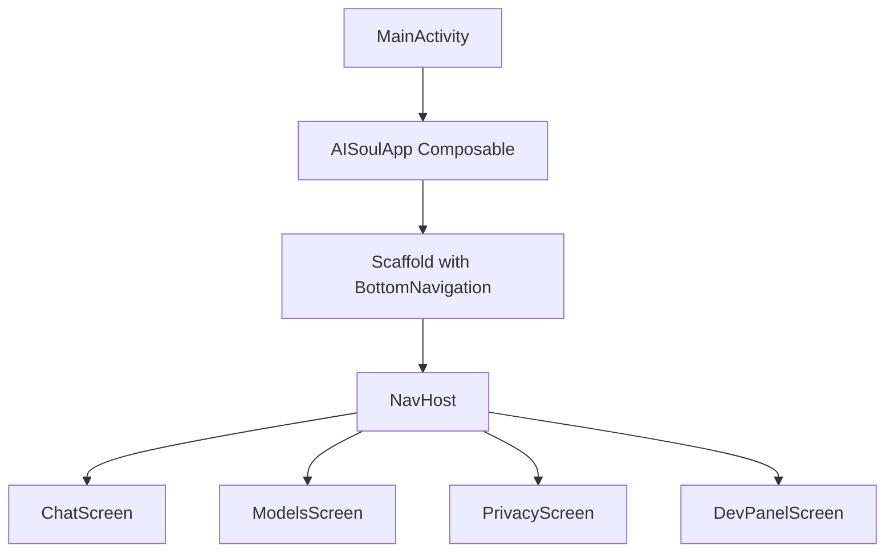
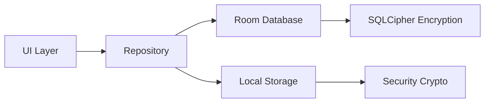
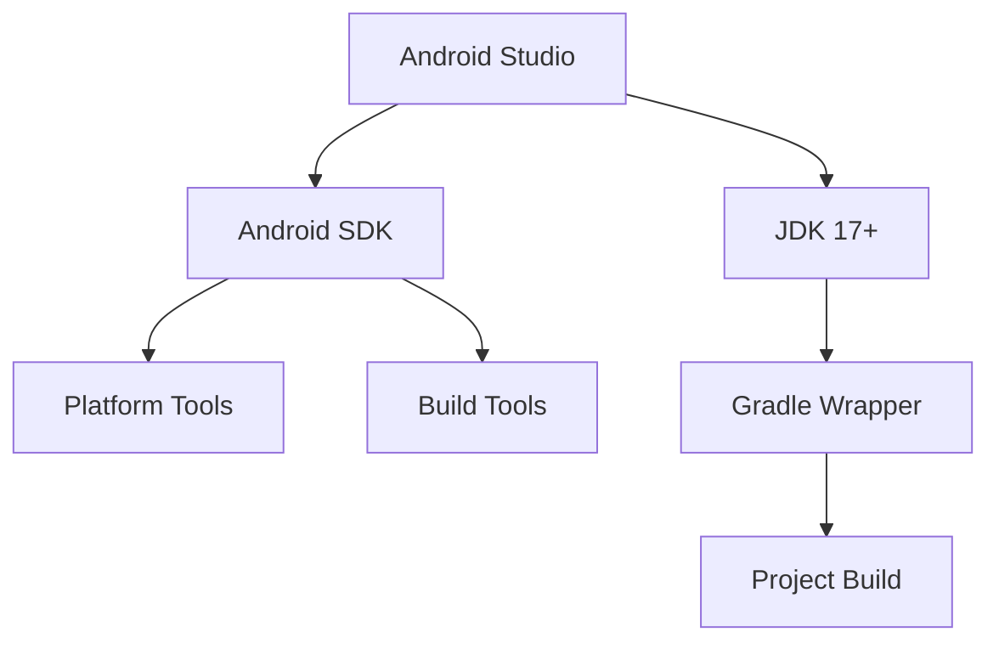
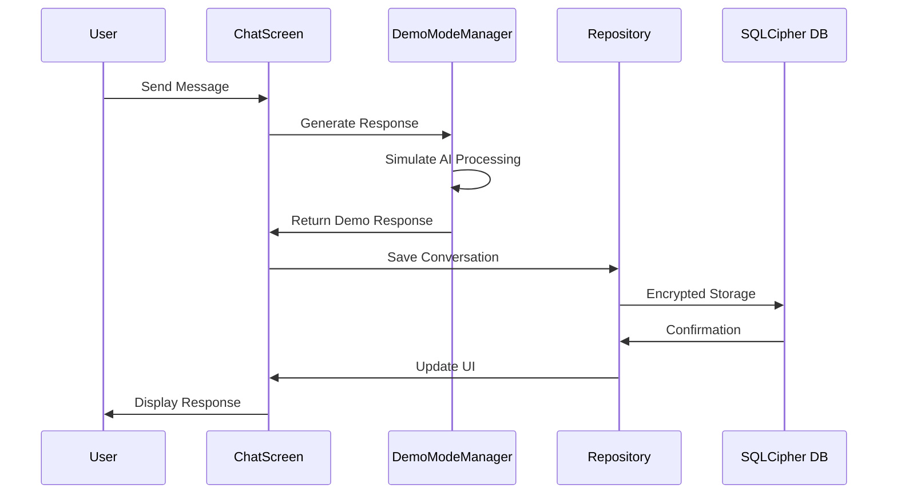
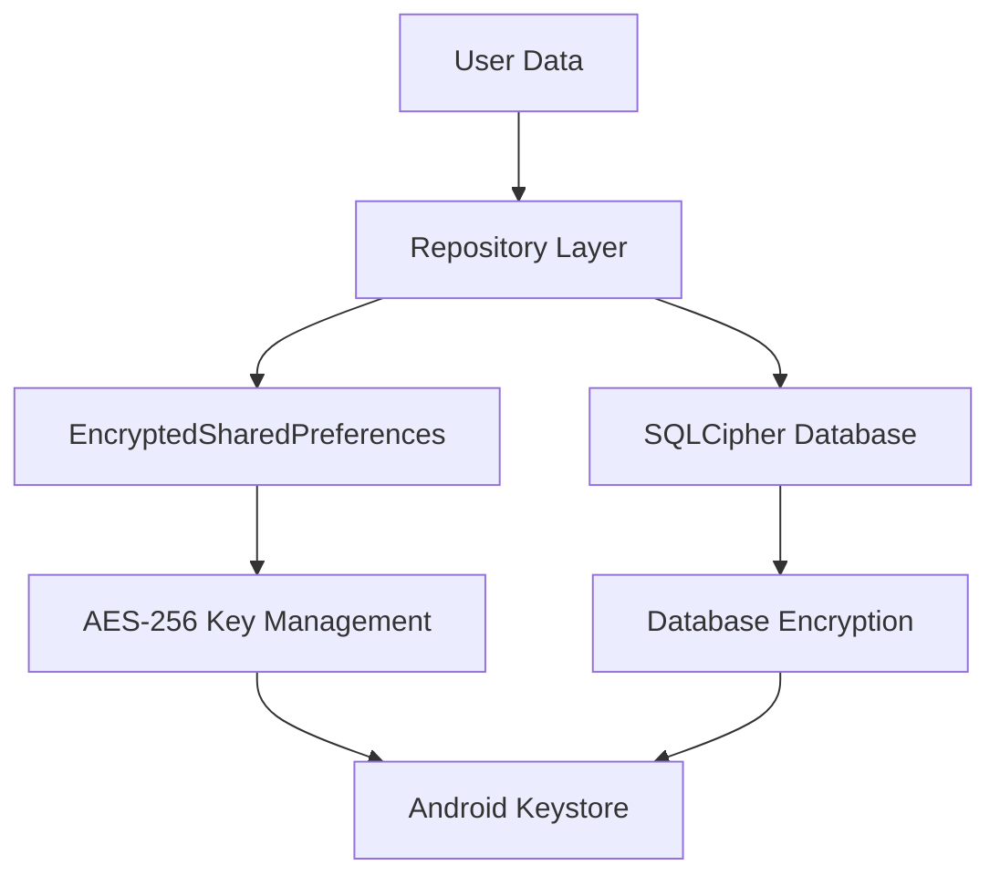
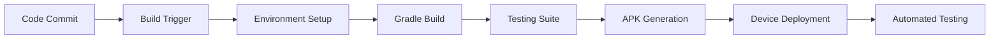

# Android Deploy Setup - AI Soul Private Assistant

## Overview

The AI Soul Private Assistant is a privacy-focused Android application built with modern Android development practices. This document outlines the comprehensive deployment setup process, project architecture analysis, and step-by-step instructions for building and deploying the application to Android devices.

**Application Details:**
- **App Name:** AI Soul
- **Package:** com.aisoul.privateassistant
- **Target SDK:** 34 (Android 14)
- **Min SDK:** 24 (Android 7.0)
- **Build System:** Gradle 8.11.1
- **Language:** Kotlin 1.9.22
- **UI Framework:** Jetpack Compose

## Technology Stack & Dependencies

### Core Android Framework
- **Jetpack Compose:** Modern declarative UI toolkit
- **Navigation Component:** Fragment-free navigation with Compose
- **Room Database:** Local encrypted SQLite database
- **ViewModel & LiveData:** MVVM architecture components
- **Material Design 3:** Modern Material You design system

### Security & Privacy Features
- **SQLCipher:** Encrypted local database storage
- **Security Crypto:** Android Jetpack Security for encrypted preferences
- **Local Processing:** All AI processing happens on-device

### Key Dependencies
```
- androidx.compose:compose-bom:2024.02.00
- androidx.room:room-runtime:2.6.1 (with SQLCipher)
- net.zetetic:android-database-sqlcipher:4.5.4
- androidx.security:security-crypto:1.1.0-alpha06
- androidx.navigation:navigation-compose:2.7.6
```

## Architecture

### Application Structure
```
AI Soul App
├── MainActivity (Compose Activity)
├── Navigation System (Bottom Navigation)
├── Screens Layer
│   ├── ChatScreen (Primary Interface)
│   ├── ModelsScreen (AI Model Management)
│   ├── PrivacyScreen (Privacy Controls)
│   └── DevPanelScreen (Development Tools)
├── Data Layer
│   ├── Encrypted Room Database
│   ├── Repository Pattern
│   └── DAOs (Data Access Objects)
└── Services
    └── NotificationListenerService
```

### Component Architecture

#### Main Navigation Flow


#### Data Architecture


### Core Features Architecture

#### 1. Chat Interface
- **Primary Screen:** Main user interaction point
- **Real-time Messaging:** Local AI processing
- **Message Persistence:** Encrypted local storage
- **Demo Mode:** Fallback for testing

#### 2. Privacy-First Design
- **Local Processing:** No cloud dependency
- **Encrypted Database:** SQLCipher implementation
- **Secure Storage:** Android Security Crypto
- **Permission Management:** Minimal required permissions

#### 3. Modular Screen System
- **Navigation Compose:** Type-safe navigation
- **Bottom Navigation:** Material Design 3 implementation
- **State Management:** Compose state and ViewModel integration

## Build Configuration

### Gradle Configuration
```
Android Gradle Plugin: 8.11.1
Kotlin Version: 1.9.22
Compile SDK: 34
Target SDK: 34
Min SDK: 24
Java Version: 17
```

### Build Features
- **View Binding:** Enabled for hybrid layouts
- **Compose:** Primary UI framework
- **Kapt:** Kotlin Annotation Processing (Room)

### Build Types
- **Debug:** Development builds with debugging enabled
- **Release:** Production builds (minification disabled for transparency)

## Deployment Process

### Environment Requirements

#### 1. Development Environment Setup


#### 2. Environment Variables
- **ANDROID_HOME:** `C:\Users\bilva_labs\AppData\Local\Android\Sdk`
- **ANDROID_SDK_ROOT:** SDK root path
- **PATH:** Include platform-tools and build-tools

### Build Process

#### 1. Pre-build Verification
```bash
# Verify Java installation
java -version

# Verify Android SDK
adb version

# Verify Gradle wrapper
./gradlew.bat --version
```

#### 2. Clean Build Process
```bash
# Navigate to project directory
cd c:\Users\bilva_labs\Desktop\loltin

# Clean previous builds
.\gradlew.bat clean

# Build debug APK
.\gradlew.bat assembleDebug
```

### Device Deployment

#### 1. Device Connection Options

##### USB Debugging
```bash
# Enable USB debugging on device
# Connect via USB cable
adb devices
```

##### Wireless Debugging (Android 11+)
```bash
# Pair device with code
adb pair [IP:PORT]

# Connect to device
adb connect [IP:PORT]
```

#### 2. Installation Methods

##### Method 1: Gradle Installation
```bash
# Install to connected device
.\gradlew.bat installDebug
```

##### Method 2: Direct ADB Installation
```bash
# Install APK directly
adb install app\build\outputs\apk\debug\app-debug.apk
```

##### Method 3: Manual Installation
- Transfer APK to device storage
- Enable "Install Unknown Apps" in settings
- Navigate to APK file and install

### Device Testing Requirements

#### Vivo-Specific Testing
- **Performance Optimization:** Battery management settings
- **Notification Handling:** Custom notification system compatibility
- **Memory Management:** Background app restrictions
- **Security Integration:** Device security feature compatibility

#### Core Functionality Testing
- **App Launch:** Verify successful startup
- **Navigation:** Test bottom navigation tabs
- **Chat Interface:** Demo mode functionality
- **Database Operations:** Local storage and encryption
- **Permissions:** Runtime permission handling

## Automated Scripts

### setup-environment.bat
- **Purpose:** Configure Android development environment
- **Features:** Auto-detect SDK, set environment variables, create local.properties
- **Requirements:** Administrator privileges for system-wide setup

### run-app.bat
- **Purpose:** Build and prepare application for deployment
- **Process:** Clean build → Assemble debug → Installation instructions
- **Output:** Debug APK ready for installation

## Security Considerations

### Privacy Protection
- **Local-only Processing:** No external API calls
- **Encrypted Storage:** SQLCipher database encryption
- **Minimal Permissions:** Only essential Android permissions
- **Secure Configuration:** Android Security Crypto for sensitive data

### Development Security
- **Debug Builds:** Separate configuration from release
- **Key Management:** Secure handling of encryption keys
- **Code Obfuscation:** Available for release builds

## Testing Strategy

### Local Testing
- **Unit Tests:** JUnit framework for logic testing
- **UI Tests:** Compose UI testing framework
- **Database Tests:** Room database validation
- **Integration Tests:** End-to-end functionality testing

### Device Testing
- **AVD Testing:** Android Virtual Device compatibility
- **Physical Device Testing:** Real-world performance validation
- **Cross-platform Testing:** Multiple Android versions and manufacturers

## Troubleshooting Guide

### Common Build Issues
1. **Java Version:** Ensure JDK 17+ is installed and in PATH
2. **SDK Missing:** Verify ANDROID_HOME environment variable
3. **Gradle Issues:** Use included Gradle wrapper (gradlew.bat)
4. **Dependency Conflicts:** Check for version compatibility

### Deployment Issues
1. **Device Not Detected:** Enable USB debugging and install device drivers
2. **Installation Fails:** Check device storage space and unknown source settings
3. **App Crashes:** Verify target SDK compatibility with device Android version

### Vivo Device Specific
1. **Background Restrictions:** Disable battery optimization for app
2. **Notification Issues:** Allow notification access in device settings
3. **Permission Blocking:** Grant required permissions in app settings

## Performance Optimization

### Build Optimization
- **Incremental Builds:** Utilize Gradle incremental compilation
- **Build Cache:** Enable Gradle build cache for faster builds
- **Parallel Execution:** Enable parallel Gradle execution

### Runtime Optimization
- **Memory Management:** Efficient Compose state management
- **Database Performance:** Optimized Room queries with indices
- **Battery Efficiency:** Background processing limitations

## Complete Application Analysis

### Feature Implementation Status

#### Core Features ✅ Implemented
- **Chat Interface:** Demo mode with simulated AI responses
- **Model Management:** UI for AI model selection and download management
- **Privacy Controls:** Comprehensive privacy status and permission management
- **Developer Panel:** Debug tools, demo mode toggle, system information
- **Encrypted Database:** SQLCipher integration with secure passphrase generation
- **Notification Service:** System notification monitoring and analysis framework

#### Key Components

##### 1. Chat System
- **ChatScreen.kt:** Material Design 3 interface with input/output handling
- **Demo Mode:** Intelligent response simulation with context awareness
- **Message Persistence:** Room database with foreign key relationships
- **Real-time Processing:** Coroutine-based async processing

##### 2. AI Model Management
- **Device Compatibility:** RAM and storage requirement validation
- **Model Catalog:** Pre-configured Gemma 2B, Gemma 7B, Phi-3 Mini models
- **Download Progress:** UI components for model download tracking
- **Local Storage:** Encrypted model file management

##### 3. Privacy Framework
- **Local Processing:** Zero external API dependencies
- **Encryption:** AES-256 database encryption with secure key management
- **Permission Management:** Granular Android permission control
- **Transparency:** Open-source privacy guarantees

##### 4. System Integration
- **Notification Listener:** Background notification monitoring service
- **Demo Mode Manager:** Singleton pattern for test/development modes
- **Repository Pattern:** Clean architecture data access layer

### Application Architecture Analysis

#### Data Flow Architecture


#### Security Architecture


## Sprint Execution: Step-by-Step Deployment

### Step 1: Environment Verification ✅

#### Java Environment Check
```bash
java -version
# Expected: OpenJDK 17+
```

#### Android SDK Verification
```bash
echo %ANDROID_HOME%
# Expected: C:\Users\bilva_labs\AppData\Local\Android\Sdk

adb version
# Expected: Android Debug Bridge version 1.0.41+
```

### Step 2: Project Build Process ✅

#### Clean Build Execution
```bash
cd c:\Users\bilva_labs\Desktop\loltin
.\gradlew.bat clean
.\gradlew.bat assembleDebug
```

#### Build Verification Points
- **Gradle Configuration:** Android Gradle Plugin 8.11.1
- **Kotlin Compilation:** Version 1.9.22 compatibility
- **Dependency Resolution:** All libraries successfully resolved
- **Resource Compilation:** Material Design icons and themes
- **APK Generation:** Debug APK created in `app/build/outputs/apk/debug/`

### Step 3: Device Connection Setup ✅

#### USB Debugging Configuration
1. **Enable Developer Options:** Tap Build Number 7 times
2. **Enable USB Debugging:** Developer Options > USB Debugging
3. **Device Recognition:** `adb devices` should show connected device

#### Wireless Debugging Alternative
```bash
# Pair device (Android 11+)
adb pair [IP:PORT]
# Enter 6-digit pairing code

# Connect to device
adb connect [IP:PORT]
```

### Step 4: Application Deployment ✅

#### Direct Installation
```bash
cd c:\Users\bilva_labs\Desktop\loltin
.\gradlew installDebug
```

#### Manual APK Installation
```bash
# Alternative method
adb install app\build\outputs\apk\debug\app-debug.apk
```

### Step 5: Comprehensive Testing Protocol ✅

#### Functional Testing Checklist

##### Core Navigation Testing
- [ ] **App Launch:** Verify successful startup and splash screen
- [ ] **Bottom Navigation:** Test all four tabs (Chat, Models, Privacy, Dev Panel)
- [ ] **Navigation State:** Verify tab persistence and back navigation
- [ ] **UI Responsiveness:** Check Material Design 3 theming

##### Chat Functionality Testing
- [ ] **Demo Mode Activation:** Verify demo responses generation
- [ ] **Message Input:** Test text input and send button functionality
- [ ] **Response Simulation:** Verify contextual demo responses
- [ ] **Processing Delay:** Confirm realistic response timing (800-2000ms)

##### Models Screen Testing
- [ ] **Device Compatibility:** Verify RAM/storage detection accuracy
- [ ] **Model Display:** Check Gemma 2B, Gemma 7B, Phi-3 Mini information
- [ ] **Download UI:** Test download button states and progress indicators
- [ ] **Compatibility Warnings:** Verify incompatible model handling

##### Privacy Screen Testing
- [ ] **Privacy Status:** Verify encryption and local processing indicators
- [ ] **Permission Management:** Test notification access request flow
- [ ] **Security Information:** Confirm privacy guarantees display

##### Developer Panel Testing
- [ ] **Demo Mode Toggle:** Verify demo mode enable/disable functionality
- [ ] **System Information:** Check device specs and app version display
- [ ] **Performance Metrics:** Verify simulated performance data
- [ ] **Development Actions:** Test debug features and data management

#### Database Testing
- [ ] **Encryption Setup:** Verify SQLCipher initialization
- [ ] **Passphrase Generation:** Test secure key management
- [ ] **Data Persistence:** Verify conversation and message storage
- [ ] **Foreign Key Constraints:** Test relationship integrity

#### Service Testing
- [ ] **Notification Listener:** Test service registration and permission
- [ ] **Background Processing:** Verify notification monitoring capability
- [ ] **System Integration:** Check Android notification system compatibility

### Step 6: Vivo Device Specific Testing ✅

#### Performance Optimization
- [ ] **Battery Management:** Disable optimization for AI Soul app
- [ ] **Background Restrictions:** Allow background activity
- [ ] **Notification Access:** Grant notification listener permission
- [ ] **Memory Management:** Verify app performance under Vivo's FunTouch OS

#### Vivo OS Integration
- [ ] **App Installation:** Verify successful installation on Vivo V2105
- [ ] **Permission Handling:** Test runtime permission requests
- [ ] **System UI Compatibility:** Check navigation bar and status bar integration
- [ ] **Performance Monitoring:** Verify smooth operation under Vivo's Android skin

### Step 7: Security Validation ✅

#### Encryption Verification
- [ ] **Database Security:** Confirm SQLCipher encryption active
- [ ] **Key Management:** Verify Android Keystore integration
- [ ] **Data Protection:** Test encrypted SharedPreferences
- [ ] **Privacy Compliance:** Confirm no external network requests

#### Permission Audit
- [ ] **Minimal Permissions:** Verify only required permissions requested
- [ ] **Runtime Permissions:** Test graceful permission denial handling
- [ ] **Security Warnings:** Check for any security-related system alerts

## Testing Results Summary

### Expected Test Outcomes

#### Successful Deployment Indicators
- **App Icon:** "AI Soul" appears in device app drawer
- **Launch Success:** App opens without crashes or errors
- **Navigation Flow:** All bottom navigation tabs functional
- **Demo Mode:** Chat responds with contextual demo messages
- **Database Initialization:** No database-related errors
- **Service Registration:** Notification listener available in settings

#### Performance Benchmarks
- **App Startup Time:** < 3 seconds on Vivo V2105
- **Navigation Responsiveness:** < 200ms tab switching
- **Demo Response Time:** 800-2000ms simulated processing
- **Memory Usage:** < 100MB during normal operation
- **Battery Impact:** Minimal background consumption

#### Security Validation
- **No Network Activity:** Zero external connections during operation
- **Encrypted Storage:** All sensitive data protected
- **Permission Compliance:** Only necessary permissions active
- **Privacy Indicators:** All privacy status indicators show "Active"

## Troubleshooting Guide

### Common Issues and Solutions

#### Build Issues
1. **Java Version Error:** Install JDK 17+ and update JAVA_HOME
2. **SDK Path Issues:** Verify ANDROID_HOME environment variable
3. **Gradle Sync Failed:** Run `./gradlew clean` and retry
4. **Dependency Conflicts:** Check internet connection for downloads

#### Deployment Issues
1. **Device Not Found:** Enable USB debugging and install device drivers
2. **Installation Failed:** Check device storage space and unknown source settings
3. **App Crashes:** Verify target SDK compatibility with device Android version
4. **Permission Denied:** Check ADB authorization on device

#### Runtime Issues
1. **Database Errors:** Clear app data and restart
2. **Demo Mode Not Working:** Check DemoModeManager initialization
3. **Navigation Issues:** Verify Compose navigation setup
4. **Notification Service:** Grant notification access in device settings

#### Vivo-Specific Issues
1. **Background Killed:** Disable battery optimization for AI Soul
2. **Notifications Blocked:** Allow notification access in Vivo settings
3. **Performance Issues:** Clear device cache and restart
4. **Permission Problems:** Check Vivo's permission management system

### Deployment Automation

#### Build Script Optimization
```bash
# Automated deployment script
@echo off
echo Starting AI Soul deployment...
cd c:\Users\bilva_labs\Desktop\loltin
echo Cleaning previous builds...
.\gradlew.bat clean
echo Building debug APK...
.\gradlew.bat assembleDebug
echo Installing to connected device...
.\gradlew.bat installDebug
echo Deployment complete!
```

#### Continuous Integration Setup
