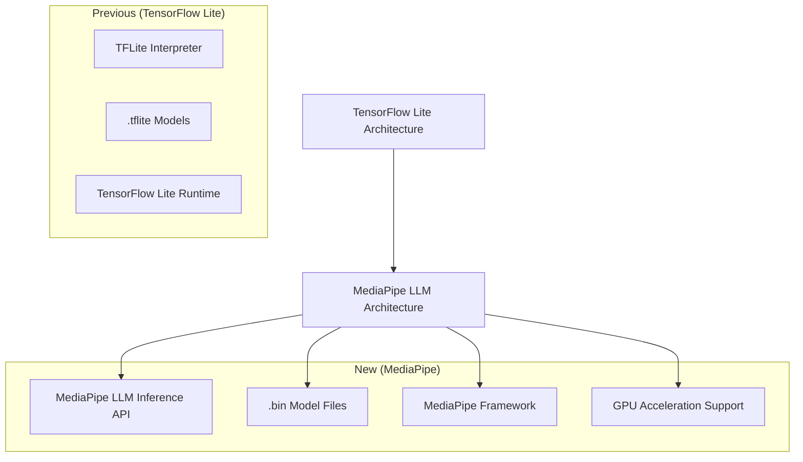
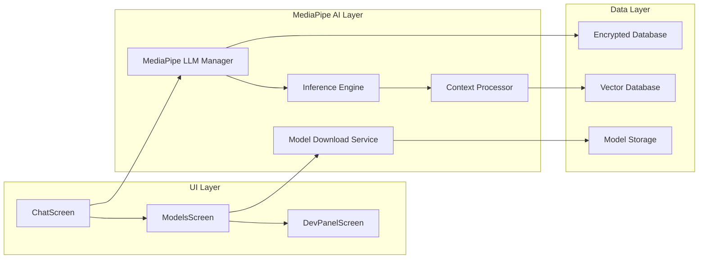
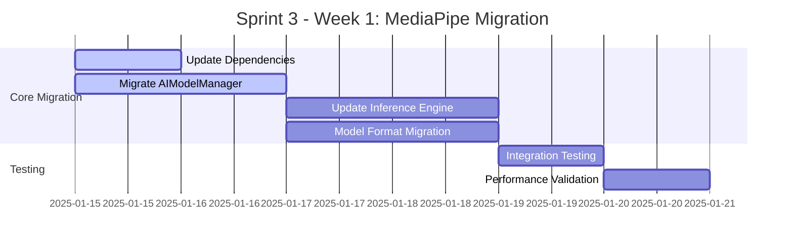
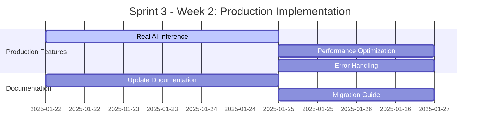
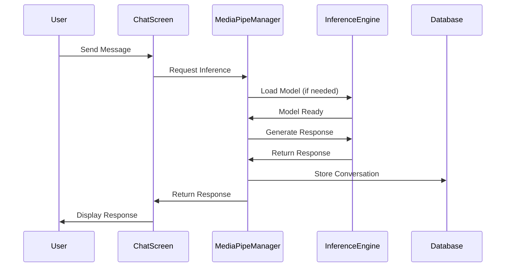
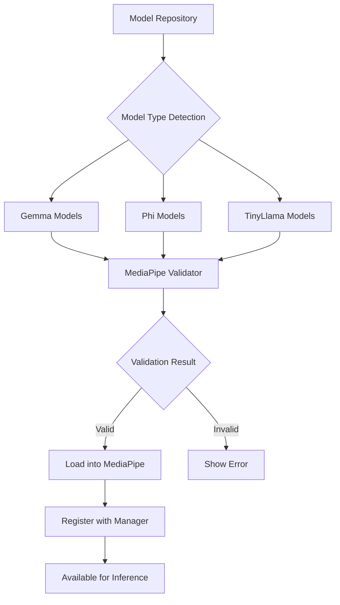

# Sprint Completion Planning - MediaPipe Migration & Next Sprint

## Overview

This document outlines the complete sprint planning for AI Soul, focusing on the critical MediaPipe migration from TensorFlow Lite and the comprehensive next sprint execution. The project is transitioning from TensorFlow Lite to MediaPipe's LLM Inference API for enhanced on-device AI processing capabilities.

## Current Sprint Status

### Completed Components (Sprint 1-2)
- ✅ Foundation architecture with encrypted database
- ✅ UI framework with Jetpack Compose + Material Design 3
- ✅ Basic AI model management infrastructure
- ✅ Voice interface implementation
- ✅ Notification analysis system
- ✅ SMS integration with smart responses
- ✅ Vector database foundation with FAISS

### Critical Migration Required
The project requires immediate migration from TensorFlow Lite to MediaPipe for LLM inference, affecting:
- AI model processing architecture
- Model loading and management systems
- Inference pipeline implementation
- Documentation updates across all technical specifications

## MediaPipe Migration Architecture

### Technology Stack Transition



### Component Architecture



## MediaPipe Migration Tasks

### 1. Core Infrastructure Updates

#### AI Model Management Migration
- **AIModelManager.kt** - Replace TensorFlow Lite with MediaPipe LLM API
- **ModelDownloadService.kt** - Update for .bin file format instead of .tflite
- **AIInferenceEngine.kt** - Implement MediaPipe inference pipeline

#### Model File Format Changes
- **Previous**: `.tflite` files with TensorFlow Lite interpreter
- **New**: `.bin` files with MediaPipe LLM Inference API
- **Storage**: Update file handling and validation logic

#### Supported Models Migration
```
MediaPipe Compatible Models:
├── Gemma 2B (.bin format)
├── Gemma 7B (.bin format)  
├── Gemma 3 270M (.bin format)
├── Microsoft Phi-2 (.bin format)
├── Microsoft Phi-3 Mini (.bin format)
└── TinyLlama variants (.bin format)
```

### 2. Technical Implementation Changes

#### Dependency Updates
```kotlin
// Remove TensorFlow Lite dependencies
// implementation 'org.tensorflow:tensorflow-lite:2.14.0'

// Add MediaPipe dependencies
implementation 'com.google.mediapipe:mediapipe-tasks-text:latest'
implementation 'com.google.mediapipe:mediapipe-framework:latest'
```

#### Inference Pipeline Redesign
```kotlin
// Previous TensorFlow Lite approach
class AIInferenceEngine {
    private var tfliteInterpreter: Interpreter?
    
    fun loadModel(modelPath: String) {
        tfliteInterpreter = Interpreter(File(modelPath))
    }
}

// New MediaPipe approach
class MediaPipeInferenceEngine {
    private var llmInference: LlmInference?
    
    fun loadModel(modelPath: String) {
        llmInference = LlmInference.createFromFile(modelPath)
    }
}
```

### 3. Documentation Updates Required

#### Files Requiring Documentation Updates
- `README.md` - Update technology stack and setup instructions
- `TECHNICAL_DOCUMENTATION.md` - Replace TensorFlow Lite references
- `MODEL_MANAGEMENT_GUIDE.md` - Update for .bin files and MediaPipe
- `DEVELOPMENT_SUMMARY.md` - Reflect MediaPipe architecture
- `MEDIAPIPE_MIGRATION.md` - Create comprehensive migration guide

#### API Documentation Updates
- Model loading procedures
- Inference API changes  
- Error handling modifications
- Performance optimization guidelines

## Next Sprint Planning (Sprint 3)

### Sprint 3 Objectives
**Primary Goal**: Complete MediaPipe migration and implement production-ready AI inference

**Duration**: 2 weeks
**Focus Areas**: Migration completion, production AI integration, performance optimization

### Sprint 3 Task Breakdown

#### Week 1: MediaPipe Integration


#### Week 2: Production Ready


### Detailed Implementation Tasks

#### 1. MediaPipe Infrastructure (Priority: P0)
**Task**: Complete migration to MediaPipe LLM Inference API
**Components**:
- Update `AIModelManager.kt` for MediaPipe compatibility
- Migrate `AIInferenceEngine.kt` to use MediaPipe LLM API
- Update `ModelDownloadService.kt` for .bin file handling
- Implement MediaPipe GPU acceleration

**Acceptance Criteria**:
- [ ] All TensorFlow Lite dependencies removed
- [ ] MediaPipe LLM API fully integrated
- [ ] Model loading/unloading works with .bin files
- [ ] GPU acceleration functional

#### 2. Model Management Enhancement (Priority: P0)
**Task**: Implement comprehensive model management for MediaPipe
**Components**:
- Enhanced model detection for MediaPipe-compatible models
- Manual upload functionality for .bin files
- URL download with MediaPipe model verification
- Real-time model status tracking

**Acceptance Criteria**:
- [ ] Support for Gemma 2B/7B/270M in .bin format
- [ ] Phi-2/Phi-3 model compatibility
- [ ] Manual .bin file upload working
- [ ] URL download with progress tracking

#### 3. Production AI Inference (Priority: P0)
**Task**: Replace demo mode with actual AI inference
**Components**:
- Real-time text generation using MediaPipe
- Context-aware response generation
- Conversation memory integration
- Performance optimization

**Acceptance Criteria**:
- [ ] Actual AI responses generated (no more demo mode)
- [ ] Context preservation across conversations
- [ ] Response quality meets standards
- [ ] Inference speed optimized

#### 4. Performance Optimization (Priority: P1)
**Task**: Optimize MediaPipe performance for mobile devices
**Components**:
- Memory usage optimization
- Battery efficiency improvements
- Model loading/unloading optimization
- Background processing enhancements

**Acceptance Criteria**:
- [ ] Memory usage under 512MB for 270M model
- [ ] Battery consumption optimized
- [ ] Fast model switching (< 3 seconds)
- [ ] Smooth UI during inference

#### 5. Documentation Migration (Priority: P1)
**Task**: Update all documentation for MediaPipe architecture
**Components**:
- Technical documentation updates
- API reference modifications
- Setup instruction changes
- Migration guide creation

**Acceptance Criteria**:
- [ ] All TensorFlow Lite references removed
- [ ] MediaPipe setup instructions complete
- [ ] Migration guide available
- [ ] API documentation updated

### Sprint 3 Architecture Implementation

#### MediaPipe Integration Flow


#### Model Management Architecture


### Testing Strategy

#### Integration Testing
- MediaPipe API integration validation
- Model loading/unloading stress tests
- Memory usage profiling
- Battery consumption analysis

#### Performance Testing
- Inference speed benchmarks
- Model switching performance
- UI responsiveness during AI processing
- Memory leak detection

#### User Experience Testing
- End-to-end conversation flows
- Error handling scenarios
- Model download/upload workflows
- Voice interface integration

### Risk Management

#### Technical Risks
- **MediaPipe API Learning Curve**: Mitigated by thorough documentation study
- **Model Compatibility Issues**: Addressed by comprehensive testing
- **Performance Degradation**: Monitored through continuous benchmarking
- **Memory Constraints**: Managed through optimization and device detection

#### Mitigation Strategies
- Parallel development and testing approach
- Rollback plan to TensorFlow Lite if needed
- Performance monitoring at each stage
- User feedback collection during testing

### Success Metrics

#### Technical Metrics
- **Model Loading Time**: < 3 seconds for 270M model
- **Inference Speed**: < 2 seconds per response
- **Memory Usage**: < 512MB during operation
- **Battery Impact**: < 5% additional drain per hour

#### User Experience Metrics
- **Response Quality**: User satisfaction > 80%
- **App Stability**: Zero crashes during normal operation
- **Feature Completeness**: All planned features functional
- **Performance**: Smooth operation on target devices

### Next Sprint Preparation

#### Sprint 4 Preview (Production Ready)
- Play Store preparation and submission
- Advanced AI features (RAG, advanced context)
- Multi-model conversation support
- Performance analytics and monitoring
- Security audit and hardening

## Implementation Timeline

### Week 1 Schedule
**Days 1-2**: MediaPipe dependency migration and basic integration
**Days 3-4**: Model management system updates
**Days 5-7**: Inference engine implementation and testing

### Week 2 Schedule
**Days 8-10**: Production AI inference implementation
**Days 11-12**: Performance optimization and testing
**Days 13-14**: Documentation updates and sprint review

### Deliverables

#### Technical Deliverables
- [ ] Fully functional MediaPipe integration
- [ ] Production-ready AI inference system
- [ ] Updated model management with .bin support
- [ ] Performance-optimized application
- [ ] Comprehensive test coverage

#### Documentation Deliverables
- [ ] Updated technical documentation
- [ ] MediaPipe migration guide
- [ ] Updated API references
- [ ] Performance benchmarking report
- [ ] Sprint completion report