# Enhanced Model Management: Upload & Download Guide

## 🎯 Overview

Your AI Soul app now has **comprehensive model management** supporting both **file uploads** and **URL downloads** with MediaPipe LLM compatibility. Users can easily add models through multiple methods.

## ✨ **Features Available**

### 📱 **File Upload (Local)**
- **Drag & Drop Support**: Upload .bin and .tflite files directly from device storage
- **Smart File Validation**: Automatically validates model file formats
- **Auto-Detection**: Intelligently detects model type (Gemma, Phi, etc.)
- **Instant Integration**: Models are loaded and ready immediately after upload

### 🌐 **URL Download (Remote)**
- **Custom URLs**: Download from any direct download link
- **Preset Sources**: One-click downloads from verified sources
- **Progress Tracking**: Real-time download progress with speed/ETA
- **Multiple Sources**: HuggingFace, Microsoft, Apple, and more

## 📋 **Supported Models**

### 🔥 **Gemma Models (Google)**
- **Gemma 2B Instruct** (1.2GB) - MediaPipe optimized
- **Gemma 7B Instruct** (3.8GB) - High performance

### ⚡ **Phi Models (Microsoft)**
- **Phi-3 Mini 4K** (2.7GB) - Efficient processing
- **Phi-2 Base** (2.7GB) - Compact design

### 🌟 **Alternative Models**
- **TinyLlama 1.1B** (600MB) - Ultra-lightweight
- **OpenELM 270M** (150MB) - Apple on-device optimized

## 🔧 **How to Use**

### Method 1: Upload from Device
1. **Tap "📱 Upload Model"** button
2. **Select .bin or .tflite file** from your device
3. **Wait for upload & loading** (automatic)
4. **Go to Chat tab** to use the model

### Method 2: Download from URL
1. **Tap "🌐 Download URL"** button
2. **Choose preset** OR **enter custom URL**
3. **Fill model details** (name, URL, size)
4. **Start download** and monitor progress
5. **Model auto-loads** when complete

### Method 3: Quick Presets
1. **Tap "Official URLs"** to expand presets
2. **Choose from verified models** (Gemma, Phi, etc.)
3. **Click "Use"** to auto-fill download dialog
4. **Confirm download** and wait for completion

## 📊 **Real-Time Monitoring**

### System Monitor Shows:
- **📊 Device RAM**: Real-time memory usage
- **🔥 Available Memory**: Free space tracking  
- **📱 Network Status**: WiFi/Mobile/Offline
- **📥 Active Downloads**: Current download count

### Download Progress Displays:
- **Progress Bar**: Visual download completion
- **Speed**: Real-time download speed (MB/s)
- **ETA**: Estimated time remaining
- **Status**: Current operation (downloading, validating, etc.)

## 🎨 **UI Features**

### Enhanced Interface:
- **Color-coded Status**: Green for success, red for errors
- **Smart Notifications**: Real-time status updates
- **Preset Categories**: Organized by company/type
- **Test Button**: Verify loaded models instantly

### File Validation:
- **Extension Check**: Only .bin/.tflite allowed
- **Size Detection**: Automatic file size calculation
- **Type Recognition**: Smart model type detection
- **Error Handling**: Clear error messages

## 🔄 **Model Integration Flow**

```mermaid
graph TB
    A[Choose Method] --> B[📱 Upload File]
    A --> C[🌐 Download URL]
    A --> D[🎯 Use Preset]
    
    B --> E[File Picker]
    C --> F[URL Dialog]
    D --> G[Auto-fill Dialog]
    
    E --> H[Validate & Copy]
    F --> I[Download & Validate]
    G --> I
    
    H --> J[Auto-Load Model]
    I --> J
    
    J --> K[✅ Ready for Chat!]
```



## 🛡️ **Security & Validation**

### File Security:
- **Internal Storage**: Models stored in app's private directory
- **Extension Validation**: Only model files accepted
- **Size Verification**: File size validation
- **Integrity Checks**: Model file validation

### Download Security:
- **HTTPS Only**: Secure download connections
- **Progress Verification**: Download integrity monitoring
- **Timeout Handling**: Connection timeout protection
- **Error Recovery**: Automatic retry mechanisms

## 📝 **Example URLs**

### Direct Download Links:
```
Gemma 2B:
https://huggingface.co/google/gemma-2b-it/resolve/main/model.bin

Phi-3 Mini:
https://huggingface.co/microsoft/Phi-3-mini-4k-instruct/resolve/main/model.bin

TinyLlama:
https://huggingface.co/TinyLlama/TinyLlama-1.1B-Chat-v1.0/resolve/main/model.bin
```

## 🎯 **Best Practices**

### For Optimal Performance:
1. **Use WiFi** for large model downloads
2. **Ensure sufficient storage** before downloading
3. **Close other apps** during large downloads
4. **Use smaller models** on lower-RAM devices

### Recommended Models by Device:
- **< 3GB RAM**: TinyLlama (600MB), OpenELM (150MB)
- **3-6GB RAM**: Gemma 2B (1.2GB), Phi-2 (2.7GB)
- **> 6GB RAM**: Gemma 7B (3.8GB), Phi-3 Mini (2.7GB)

## 🔍 **Troubleshooting**

### Common Issues:
- **Upload Failed**: Check file format (.bin/.tflite only)
- **Download Slow**: Switch to WiFi connection
- **Model Not Loading**: Restart app and try again
- **Storage Full**: Free up device space

### Status Messages:
- **✅ Success**: Green background, ready to use
- **⚠️ Warning**: Yellow background, check details
- **❌ Error**: Red background, retry needed
- **🔄 Processing**: Blue background, please wait

## 🚀 **What's Next**

Your enhanced model management system now supports:
- ✅ **Dual Input Methods**: Upload + Download
- ✅ **Smart Validation**: File type & integrity checks
- ✅ **Real-time Progress**: Visual feedback
- ✅ **MediaPipe Ready**: Latest LLM technology
- ✅ **Multiple Sources**: HuggingFace, Microsoft, Apple
- ✅ **Auto-Integration**: Instant model loading

**Ready to use!** Go to the Models tab and try uploading a model file or downloading from one of the preset URLs.

---

*The system maintains backward compatibility while adding powerful new features for flexible model management.*